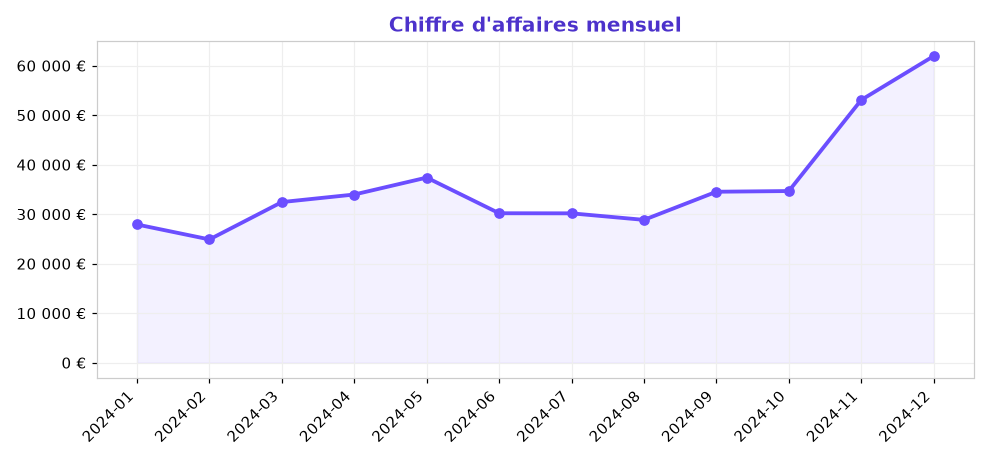
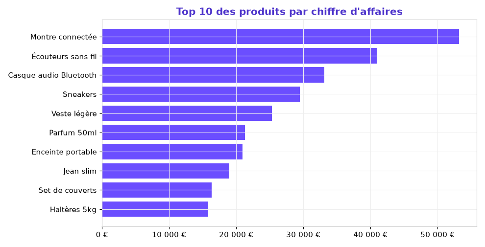
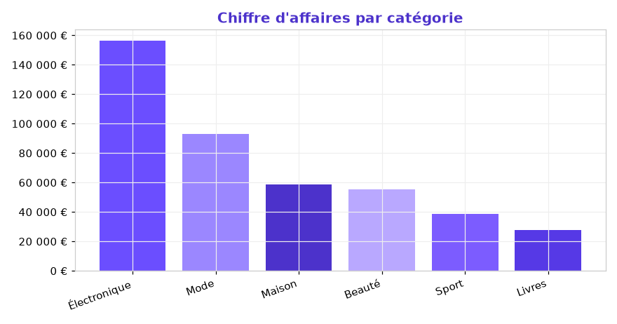
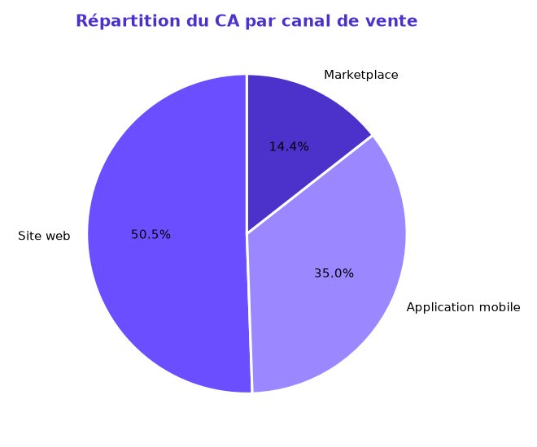

# 📊 Analyse des ventes e-commerce

Analyse exploratoire d'un an de ventes d'une boutique e-commerce fictive : identification des **tendances de chiffre d'affaires**, des **produits et catégories les plus performants** et des **canaux de vente**, afin d'aider à la décision marketing et commerciale.

> Projet réalisé par **Suz Didolène Massamouna** — Data Analyst
> 🔗 Portfolio : [suzy5670.github.io](https://suzy5670.github.io/)

---

## 🎯 Objectifs

- Mesurer la performance commerciale (CA, panier moyen, volume).
- Identifier la **saisonnalité** des ventes sur l'année.
- Déterminer les **produits / catégories** qui génèrent le plus de revenus.
- Comparer les **canaux de vente** (site web, application, marketplace).

## 🗂️ Données

Jeu de données de **6 000 lignes de commande** sur l'année 2024 ([`ventes_ecommerce.csv`](ventes_ecommerce.csv)), généré de façon réaliste (saisonnalité, promotions, multi-canal).

| Colonne | Description |
|---|---|
| `id_commande` | Identifiant de la commande |
| `date` | Date de la commande |
| `id_client` | Identifiant client (pour les clients uniques) |
| `categorie` / `produit` | Catégorie et nom du produit |
| `quantite` / `prix_unitaire` / `remise` / `montant` | Détail financier de la ligne |
| `canal` | Site web, Application mobile, Marketplace |
| `region` | Région française de livraison |
| `paiement` | Moyen de paiement |

## 🛠️ Outils

`Python` · `pandas` · `matplotlib`

---

## 🔑 Indicateurs clés

| Indicateur | Valeur |
|---|---|
| 💰 Chiffre d'affaires total | **430 072 €** |
| 🧾 Nombre de commandes | **6 000** |
| 🛒 Panier moyen | **71,68 €** |
| 👥 Clients uniques | **2 049** |
| 📦 Articles vendus | **10 215** |

---

## 📈 Résultats

### Chiffre d'affaires mensuel
Forte **saisonnalité** : pic très marqué en **novembre–décembre** (fêtes de fin d'année), creux estival en juillet–août.



### Top 10 des produits
La **Montre connectée** et les autres produits électroniques dominent le chiffre d'affaires.



### Chiffre d'affaires par catégorie
L'**Électronique** est la catégorie n°1 en valeur, devant la Mode.



### Répartition par canal de vente
Le **Site web** reste le canal principal, suivi de l'Application mobile.



---

## 💡 Recommandations

- **Anticiper les stocks** sur l'électronique avant le pic de fin d'année (nov.–déc.).
- **Dynamiser l'été** (juillet–août) via des promotions ciblées pour lisser la saisonnalité.
- **Investir sur l'application mobile**, 2ᵉ canal, pour réduire la dépendance au site web.
- **Capitaliser sur les best-sellers** (Montre connectée, Écouteurs) en cross-selling.

---

## ▶️ Reproduire l'analyse

```bash
# 1. Installer les dépendances
pip install pandas numpy matplotlib

# 2. (Optionnel) Régénérer le jeu de données
python generer_donnees.py

# 3. Lancer l'analyse (calcule les KPIs et génère les graphiques)
python analyse_ventes.py
```

## 📁 Contenu du dépôt

```
analyse-ventes-ecommerce/
├── ventes_ecommerce.csv     # Le jeu de données (6 000 lignes)
├── generer_donnees.py       # Script de génération des données
├── analyse_ventes.py        # Script d'analyse + graphiques
├── synthese.md              # Synthèse chiffrée
├── images/                  # Graphiques générés
└── README.md
```

---

## 📬 Contact

**Suz Didolène Massamouna** — Data Analyst
📧 mdane230@gmail.com · 🌐 [Portfolio](https://suzy5670.github.io/) · 🔗 [LinkedIn](https://www.linkedin.com/in/suz-didolene-massamouna/)
