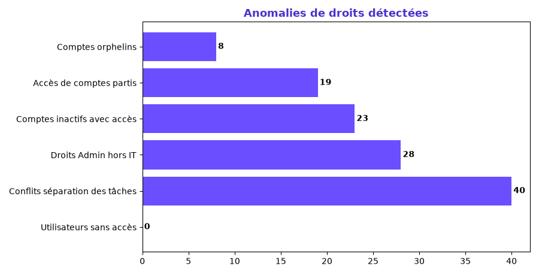

# 🛡️ Audit Analytique — Gouvernance des Droits SI

Analyse croisée de tables d'accès utilisateurs (type **Active Directory**) pour **cartographier les habilitations**, **détecter les anomalies de droits** et générer un **rapport de conformité** au service de la sécurisation du système d'information.

> Projet réalisé par **Suz Didolène Massamouna** — Data Analyst
> 🌐 Portfolio : [suzy5670.github.io](https://suzy5670.github.io/) · 🔗 [LinkedIn](https://www.linkedin.com/in/suz-didolene-massamouna/)

---

## 🎯 Objectif

Vérifier que **les bons utilisateurs ont les bons droits** : identifier les comptes et habilitations à risque (comptes inactifs ou partis, droits excessifs, conflits de séparation des tâches) pour réduire la surface d'exposition du SI.

## 🗂️ Données

Deux tables croisées (référentiel SI, données 2025) :

| Table | Contenu |
|---|---|
| [`utilisateurs.csv`](utilisateurs.csv) | 250 utilisateurs : département, statut (Actif / Inactif / Parti), dernière connexion |
| [`acces.csv`](acces.csv) | 790 habilitations : ressource, niveau (Lecture / Écriture / Admin), date d'attribution |

## 🛠️ Outils

`Active Directory` (modèle de données) · `Python` · `Pandas` (audit de données)

---

## 🔍 Contrôles réalisés

1. **Comptes orphelins** — accès rattachés à un utilisateur inexistant dans le référentiel.
2. **Accès de comptes partis** — utilisateurs ayant quitté l'entreprise mais conservant des droits.
3. **Comptes inactifs avec accès** — aucune connexion depuis plus de **90 jours**, droits toujours actifs.
4. **Droits Admin hors IT** — privilèges d'administration attribués en dehors du service informatique.
5. **Conflits de séparation des tâches (SoD)** — un même utilisateur cumule *validation* **et** *paiement* comptable.
6. **Utilisateurs sans accès** — comptes dormants.

---

## 🚨 Résultats de l'audit

**118 anomalies** détectées sur 250 utilisateurs et 790 habilitations.

| Type d'anomalie | Nombre |
|---|---|
| Comptes orphelins | **8** |
| Accès de comptes partis | **19** |
| Comptes inactifs avec accès | **23** |
| Droits Admin hors IT | **28** |
| Conflits séparation des tâches | **40** |
| Utilisateurs sans accès | 0 |



Le détail ligne à ligne des anomalies critiques est exporté dans [`anomalies_detectees.csv`](anomalies_detectees.csv) et synthétisé dans [`rapport_conformite.md`](rapport_conformite.md).

---

## 💡 Recommandations

- **Désactiver immédiatement** les accès des comptes partis et orphelins.
- **Mettre en place une revue trimestrielle** des comptes inactifs (> 90 jours).
- **Restreindre les droits Admin** au strict nécessaire (principe du moindre privilège).
- **Corriger les conflits de séparation des tâches** pour prévenir la fraude.
- **Automatiser cet audit** (ce script) pour un contrôle continu plutôt que ponctuel.

---

## ▶️ Reproduire l'audit

```bash
pip install pandas numpy matplotlib
python generer_acces.py   # (optionnel) régénère les tables utilisateurs/accès
python audit_droits.py    # croise les données, détecte les anomalies, génère le rapport
```

## 📬 Contact

**Suz Didolène Massamouna** — Data Analyst
📧 mdane230@gmail.com · 🌐 [Portfolio](https://suzy5670.github.io/) · 🔗 [LinkedIn](https://www.linkedin.com/in/suz-didolene-massamouna/)
