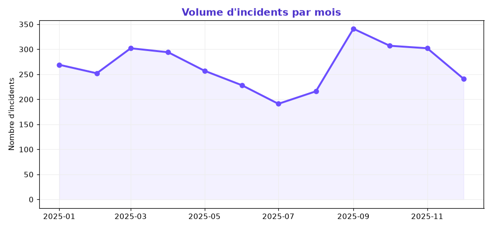
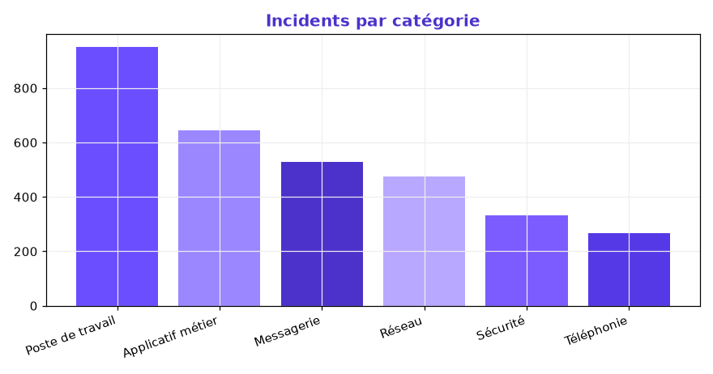
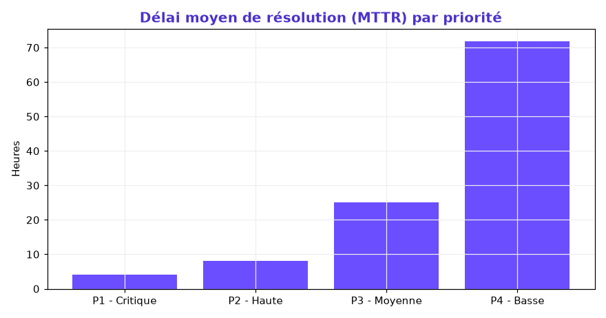
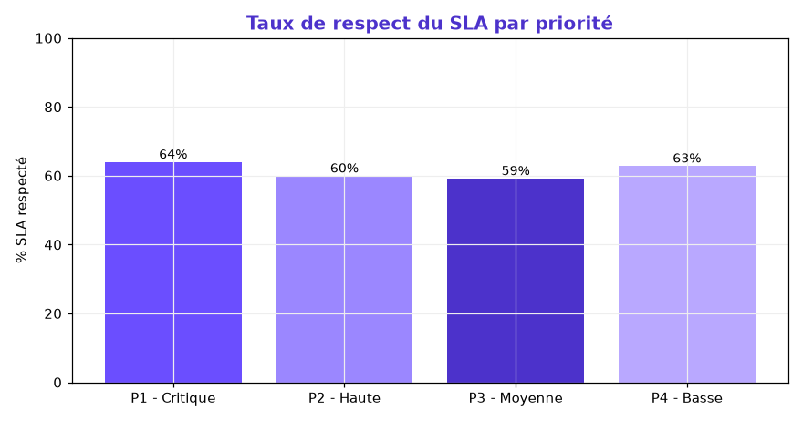

# 📊 Dashboard Analytique — Performance ITSM

Centralisation et modélisation des flux d'incidents issus de plateformes SI (**GLPI** & **ServiceNow**), et création des indicateurs d'un **tableau de bord d'aide à la décision** : volumes critiques, délais de résolution (MTTR) et respect des SLA.

> Projet réalisé par **Suz Didolène Massamouna** — Data Analyst
> 🌐 Portfolio : [suzy5670.github.io](https://suzy5670.github.io/) · 🔗 [LinkedIn](https://www.linkedin.com/in/suz-didolene-massamouna/)

---

## 🎯 Objectifs

- **Centraliser** les incidents provenant de deux outils ITSM (GLPI, ServiceNow).
- **Mesurer la charge** : volumes par période, catégorie et équipe.
- **Automatiser le calcul des délais** de résolution (MTTR).
- **Suivre les engagements de service** (respect des SLA par priorité).

## 🗂️ Données

Jeu de données de **3 200 incidents** sur l'année 2025 ([`incidents.csv`](incidents.csv)).

| Colonne | Description |
|---|---|
| `id_incident` | Identifiant de l'incident |
| `date_ouverture` / `date_resolution` | Horodatage d'ouverture et de clôture |
| `priorite` | P1 Critique → P4 Basse |
| `categorie` | Réseau, Poste de travail, Messagerie, Applicatif… |
| `equipe` | Support N1/N2, Infrastructure, Sécurité SI |
| `source` | GLPI ou ServiceNow |
| `sla_cible_h` / `delai_resolution_h` / `sla_respecte` | Engagement, délai réel et respect du SLA |

## 🛠️ Outils

`Power BI` · `Excel` · `Data Modeling` — analyse et modélisation reproduites en `Python` / `pandas`.

---

## 🔑 Indicateurs clés

| Indicateur | Valeur |
|---|---|
| 🧾 Incidents traités | **3 200** |
| ✅ Taux de résolution | **92,2 %** |
| ⏱️ MTTR (délai moyen de résolution) | **33,8 h** |
| 🎯 Respect du SLA | **60,7 %** |
| 🚨 Incidents critiques (P1) | **211** |

---

## 📈 Résultats

### Volume d'incidents par mois
Charge relativement stable, avec un **pic à la rentrée (septembre)**.



### Incidents par catégorie
La catégorie **Poste de travail** concentre le plus d'incidents (952).



### Délai moyen de résolution (MTTR) par priorité
Les incidents critiques (P1) sont traités beaucoup plus vite que les incidents de faible priorité.



### Respect du SLA par priorité
Le respect des SLA se dégrade sur les priorités basses : un axe d'amélioration clair.



---

## 💡 Recommandations

- **Renforcer le support sur le Poste de travail**, principale source d'incidents.
- **Cibler les SLA des priorités P3/P4**, où le taux de respect est le plus faible.
- **Suivre le MTTR mensuellement** pour détecter les dérives au plus tôt.
- **Anticiper le pic de septembre** par un renfort temporaire du support N1.

---

## ▶️ Reproduire l'analyse

```bash
pip install pandas numpy matplotlib
python generer_incidents.py   # (optionnel) régénère les données
python analyse_itsm.py        # calcule les KPIs et génère les graphiques
```

## 📬 Contact

**Suz Didolène Massamouna** — Data Analyst
📧 mdane230@gmail.com · 🌐 [Portfolio](https://suzy5670.github.io/) · 🔗 [LinkedIn](https://www.linkedin.com/in/suz-didolene-massamouna/)
