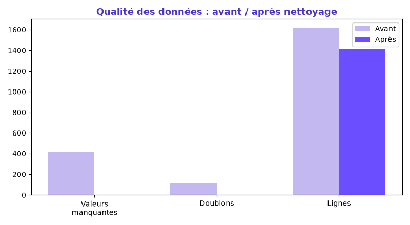

# ⚙️ Pipeline Automation — Data Quality

Conception d'un **script d'industrialisation** pour le nettoyage de bases de données métier complexes : traitement automatisé des **valeurs manquantes**, **dédoublonnage strict** et **standardisation des formats** (dates, téléphones, e-mails, montants, casse).

> Projet réalisé par **Suz Didolène Massamouna** — Data Analyst
> 🌐 Portfolio : [suzy5670.github.io](https://suzy5670.github.io/) · 🔗 [LinkedIn](https://www.linkedin.com/in/suz-didolene-massamouna/)

---

## 🎯 Objectif

Automatiser, de bout en bout, le passage d'une base **brute et incohérente** à une base **propre, fiable et exploitable**, de façon **reproductible** (un seul script à relancer).

## 🗂️ Données

Base client volontairement « sale » de **1 620 lignes** ([`donnees_brutes.csv`](donnees_brutes.csv)), contenant :
- des **valeurs manquantes** (e-mails, téléphones, villes, montants) ;
- des **doublons** (lignes entières répétées) ;
- des **formats incohérents** : dates (`2023-05-12`, `12/05/2023`, `12-05-2023`), téléphones (`06 12…`, `+33…`, `06.12…`), montants (`1 200,50`, `€1200.50`), casse et espaces superflus.

## 🛠️ Outils

`Python` · `Pandas` · `Jupyter`

---

## 🔧 Étapes du pipeline

1. **Standardisation des formats**
   - Noms / villes en `Title Case`, e-mails en minuscules, espaces supprimés.
   - Téléphones normalisés au format `+33 6 XX XX XX XX`.
   - Dates converties au format ISO `AAAA-MM-JJ`.
   - Montants convertis en nombres décimaux (`€1 200,50` → `1200.50`).
2. **Gestion des valeurs manquantes**
   - Montant manquant → `0` ; ville manquante → `Inconnu` ; téléphone/date non fournis → `Non renseigné`.
   - E-mail (donnée critique) manquant → ligne supprimée.
3. **Dédoublonnage strict**
   - Suppression des doublons exacts, puis unicité garantie par e-mail (un client = un e-mail).

---

## 📊 Résultat : avant / après

| Indicateur | Avant | Après |
|---|---|---|
| Lignes | 1 620 | **1 410** |
| Valeurs manquantes | 416 | **0** |
| Doublons exacts | 120 | **0** |

➡️ **210 lignes** supprimées (doublons + e-mails manquants), **100 % des formats standardisés**.



---

## ▶️ Reproduire le pipeline

```bash
pip install pandas numpy matplotlib
python generer_donnees_brutes.py   # (optionnel) régénère la base "sale"
python pipeline_nettoyage.py       # nettoie et produit donnees_propres.csv + rapport
```

## 📁 Contenu

```
pipeline-data-quality/
├── donnees_brutes.csv         # Base brute (1 620 lignes, sale)
├── generer_donnees_brutes.py  # Génération de la base de test
├── pipeline_nettoyage.py      # Le pipeline de nettoyage automatisé
├── donnees_propres.csv        # Résultat nettoyé (1 410 lignes)
├── rapport_qualite.md         # Rapport avant / après
└── images/avant_apres.png
```

## 📬 Contact

**Suz Didolène Massamouna** — Data Analyst
📧 mdane230@gmail.com · 🌐 [Portfolio](https://suzy5670.github.io/) · 🔗 [LinkedIn](https://www.linkedin.com/in/suz-didolene-massamouna/)
